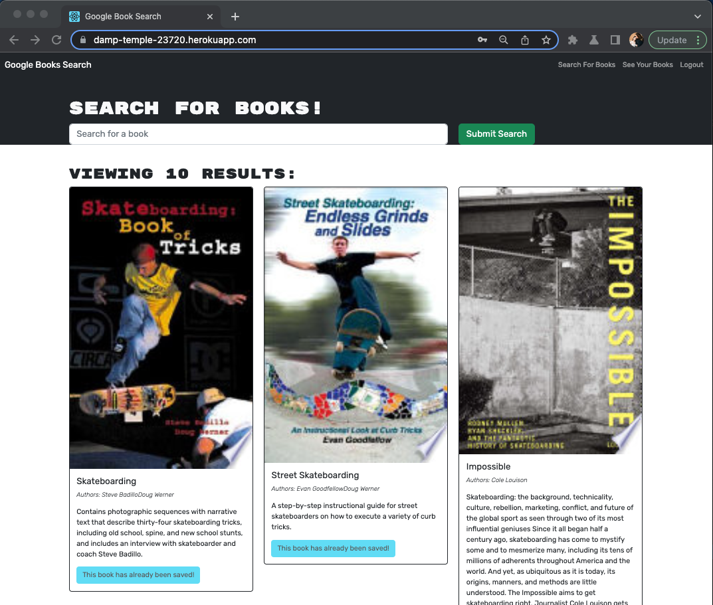
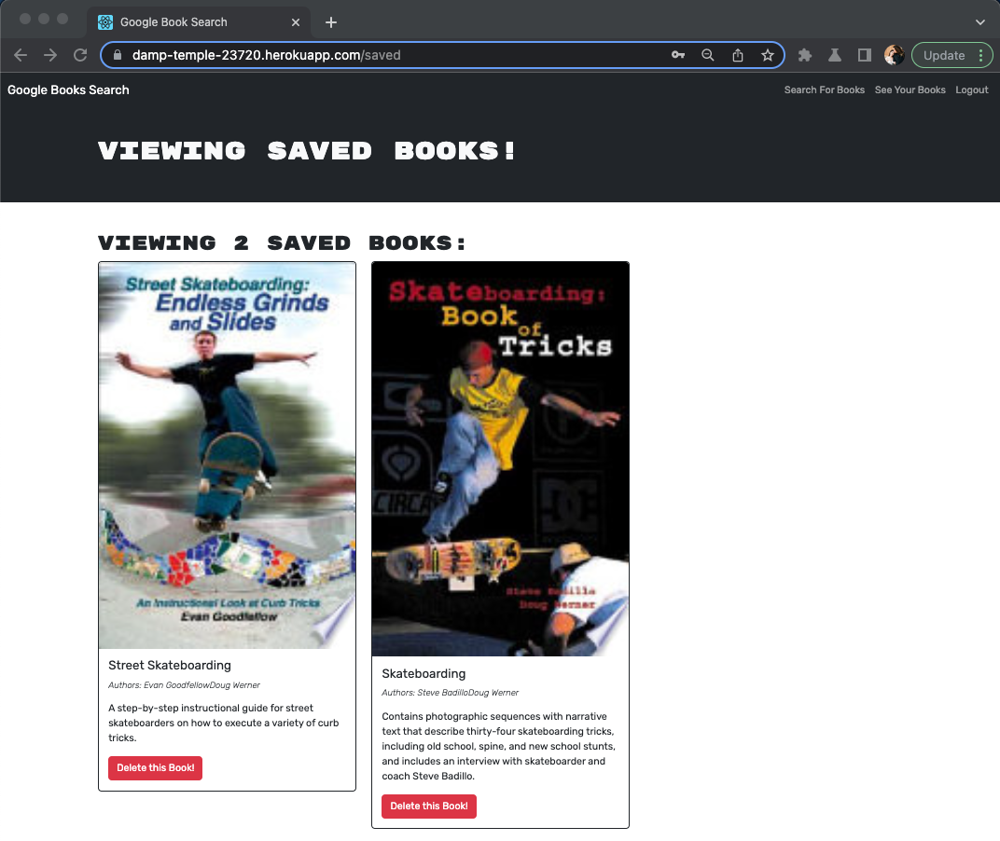

# DevCM-MERN-Book
module-21-challenge

  ## Table of Contents
  - [Description](#description)
  - [Usage](#usage)
  - [Technologies](#technologies)
  - [License](#license)
  
  ## Description:
  The purpose of this challenge is to a MERN full stack application. Where the user is able to create an user account search for books and saved them to their account. 

  Heroku deployed application link:  
  https://damp-temple-23720.herokuapp.com/  

  ## Technologies
  &bull; [MongoDB](https://www.mongodb.com/) 
  &bull; [Express](https://www.npmjs.com/package/express) 
  &bull; [React](https://react.dev/) 
  &bull; [Node.js](https://nodejs.org/en/) 
 

  ## Usage
  In order to use this application you can visit the deployed heroku link. You can search books without creating an user account. If you want to search books and save them you will have to create an account and login once logged in you are able to save all the books you want.  

 Users searched books 
  

 Users saved books 
  

  
  ## License
  MIT License
